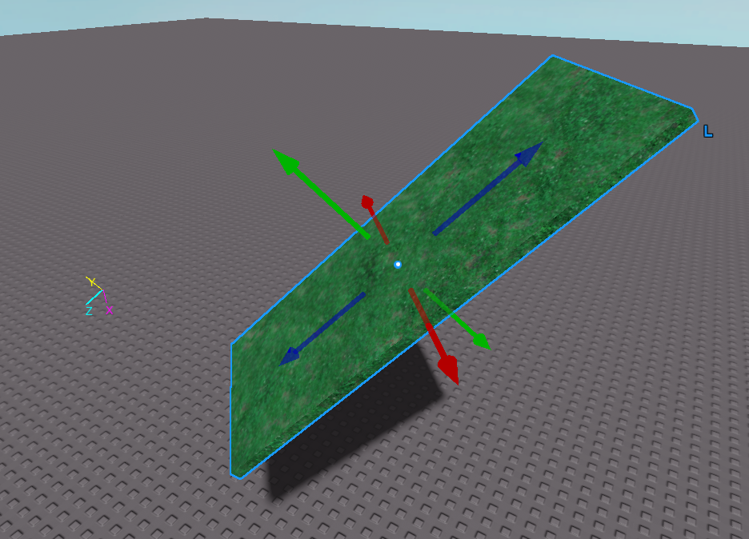

# better-view-selector

A simplified plugin replacement for the view selector plugin in Roblox studio.

You can get it [here!](https://create.roblox.com/store/asset/16349581373/Better-View-Selector)

This plugin overrides the default View Selector plugin in favour of a much simpler display that harkens back to the legacy view selector.

This plugin supports also comes with some very nifty support for showing a selected object's local space axes. By toggling `StudioService.UseLocalSpace` (by pressing ctrl + L while using the studio draggers), you can swap between this mode.

`StudioService.UseLocalSpace = false`

`StudioService.UseLocalSpace = true`

